<div align="center">

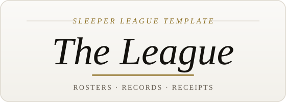

### Give your Sleeper league the site it deserves

Every season your league has ever played, in one place. Standings, scoreboards,
all-time records, head-to-head receipts, draft boards, trade history, and dynasty
rankings. Point it at one league ID and deploy. No database, no backend, no monthly bill.

<br>

[](./LICENSE)
[](https://nextjs.org)
[](https://www.typescriptlang.org)
[](https://github.com/tdodd777/TheLeague/stargazers)

<br>

<a href="https://buymeacoffee.com/tdodd" target="_blank"></a>

<br><br>

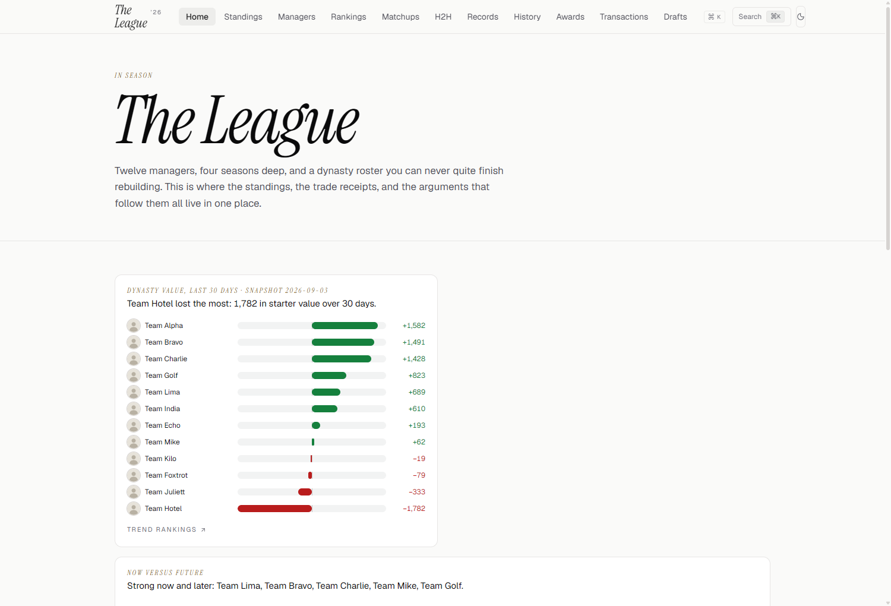

</div>

<br>

## What your league gets

<table>
<tr>
<td valign="top" width="33%">

**This season**

- Live standings with per-week scoring trends
- Weekly scoreboard with box-score receipts
- Season power rankings
- Transaction feed of adds, drops, and waivers

</td>
<td valign="top" width="33%">

**Every season before it**

- Season archive with final standings and playoff brackets
- All-time league records
- Head-to-head history between any two managers
- Draft boards, with traded picks resolved
- Trade history priced at the time of the trade

</td>
<td valign="top" width="33%">

**Dynasty tools**

- FantasyCalc-driven roster value rankings
- Contender quadrant: win-now versus future
- Manager profiles with career stats
- Thirty-day value trend for every roster

</td>
</tr>
</table>

Plus a `⌘K` command palette across players, managers, and pages, a league constitution
page, a mobile layout with a bottom tab bar, and a PWA you can install to a phone home screen.

<br>

## A closer look

<p align="center">
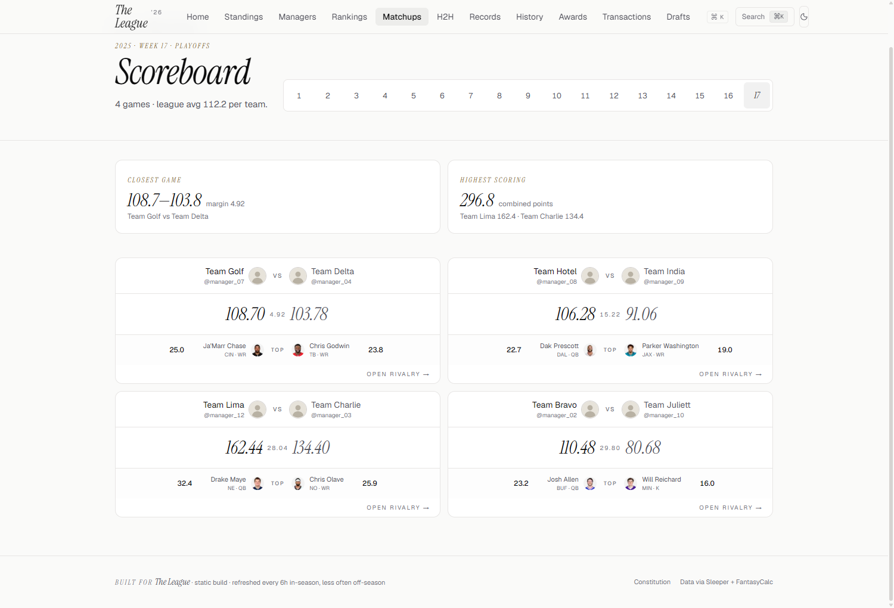
<br><sub><b>Scoreboard.</b> Every matchup for the week, with the closest game and the top scorer surfaced automatically.</sub>
</p>

<p align="center">
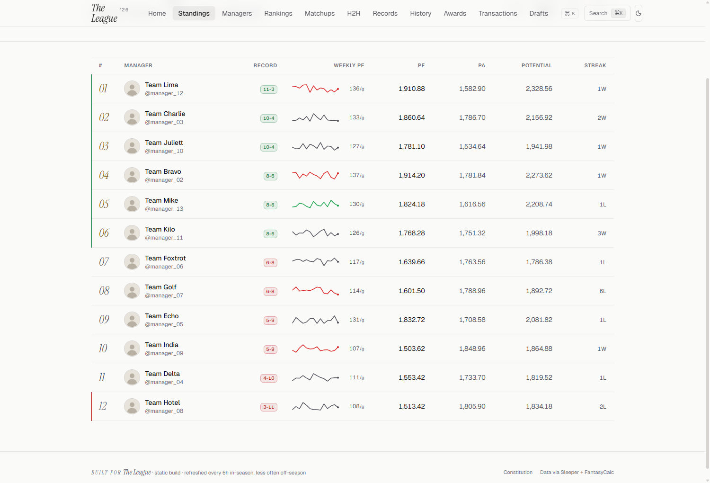
<br><sub><b>Standings.</b> Record, points for and against, potential points, and a sparkline of how the season actually went.</sub>
</p>

<p align="center">
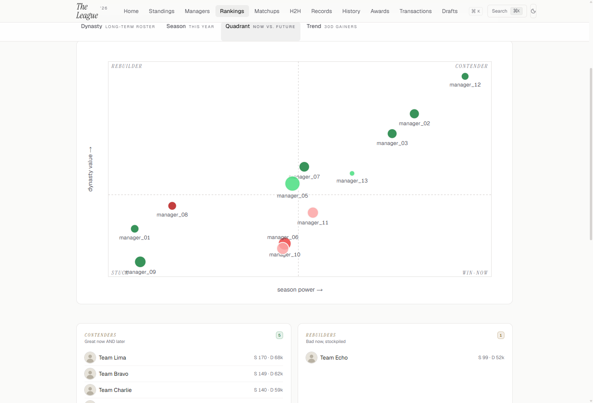
<br><sub><b>Contender quadrant.</b> Season power against dynasty value, so everyone can see who is actually rebuilding and who is just bad.</sub>
</p>

<p align="center">
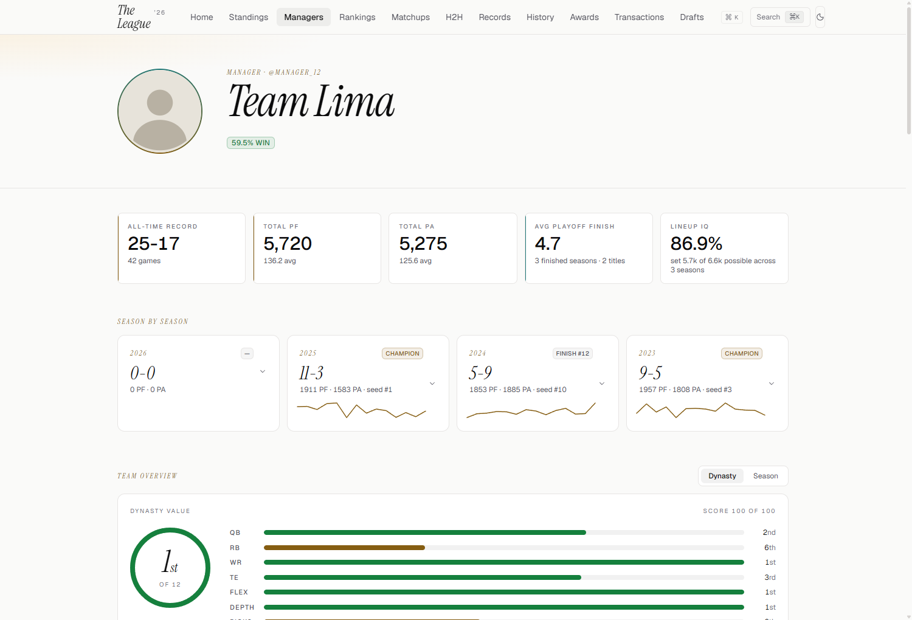
<br><sub><b>Manager profiles.</b> Career record, every season they have played, and a positional breakdown of the roster.</sub>
</p>

<p align="center">
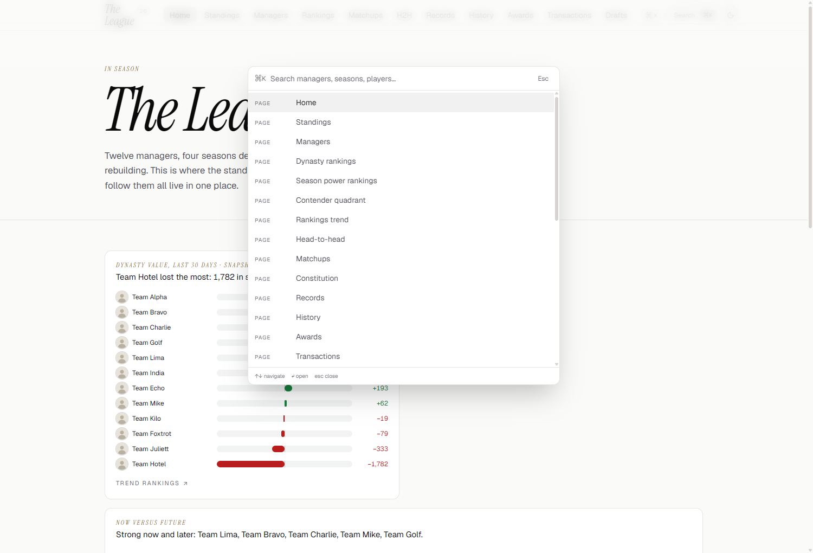
<br><sub><b>Command palette.</b> Hit <code>⌘K</code> anywhere to jump to a manager, a season, or a player.</sub>
</p>

<details>
<summary><b>More screenshots</b> (head-to-head, records, history, drafts, trades, rankings, awards, mobile)</summary>
<br>
<table>
<tr>
<td width="50%">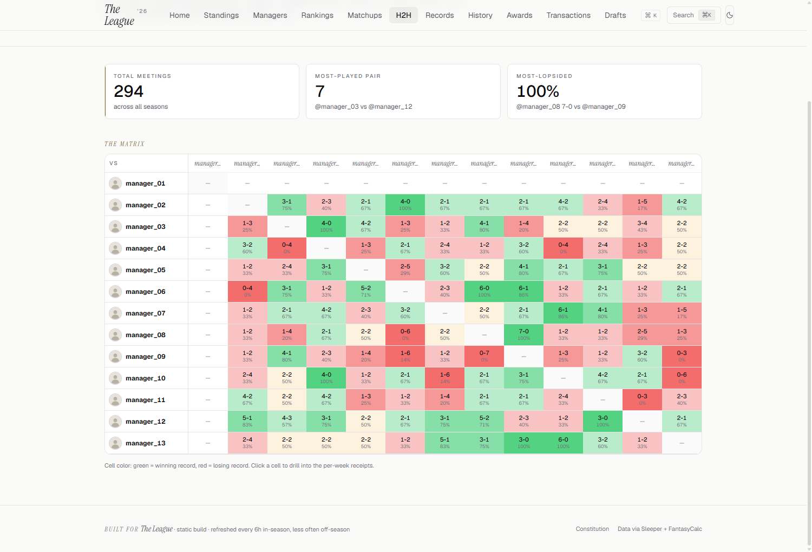<br><sub>Head-to-head matrix across every season</sub></td>
<td width="50%">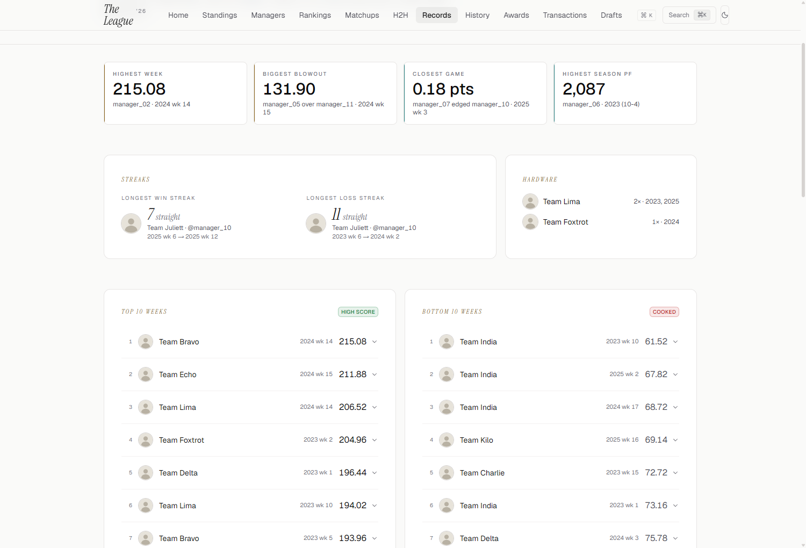<br><sub>All-time league records</sub></td>
</tr>
<tr>
<td width="50%">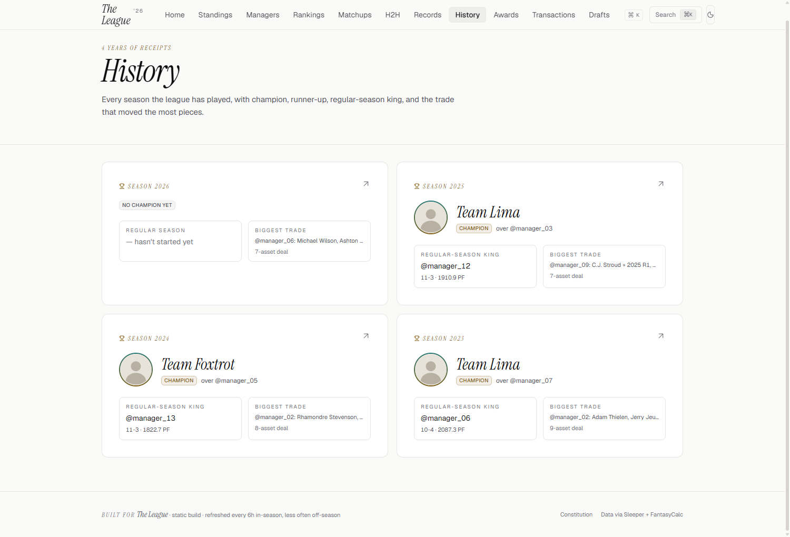<br><sub>Season archive with brackets and final standings</sub></td>
<td width="50%">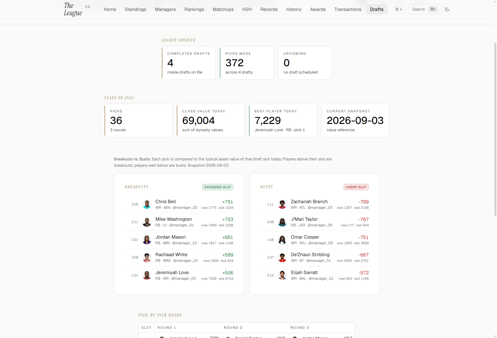<br><sub>Draft board, with traded picks resolved</sub></td>
</tr>
<tr>
<td width="50%">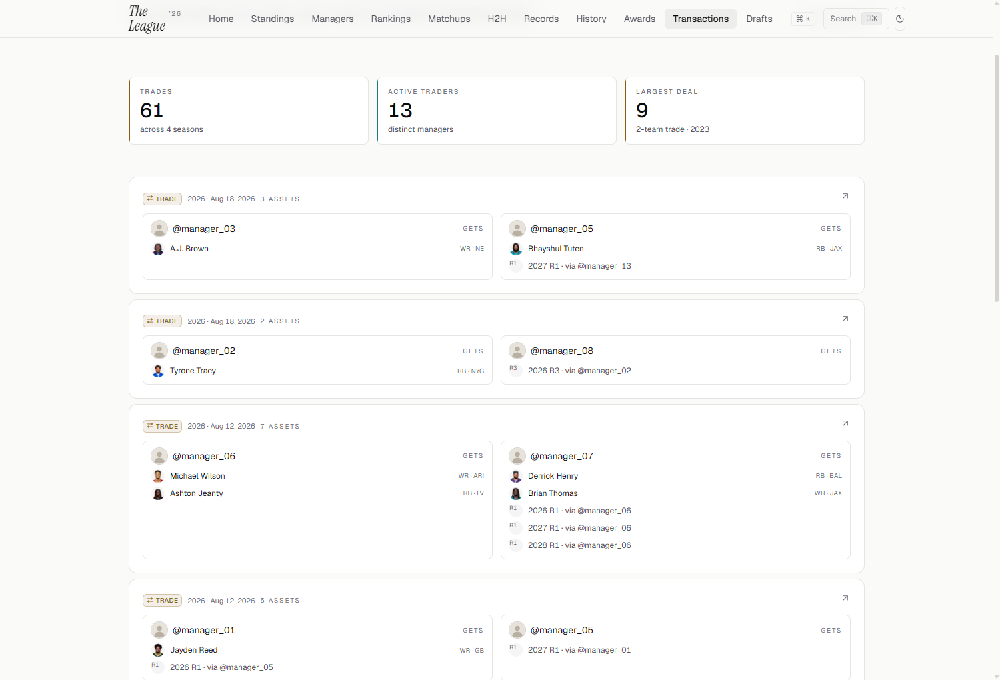<br><sub>Trade history with fairness at time of trade</sub></td>
<td width="50%">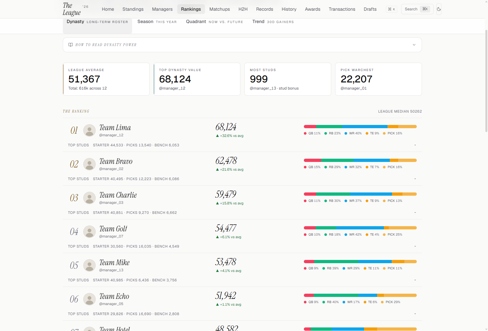<br><sub>Dynasty roster value rankings</sub></td>
</tr>
<tr>
<td width="50%">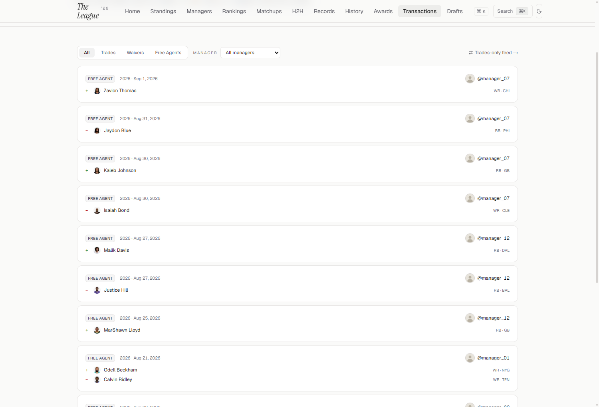<br><sub>Transaction feed</sub></td>
<td width="50%">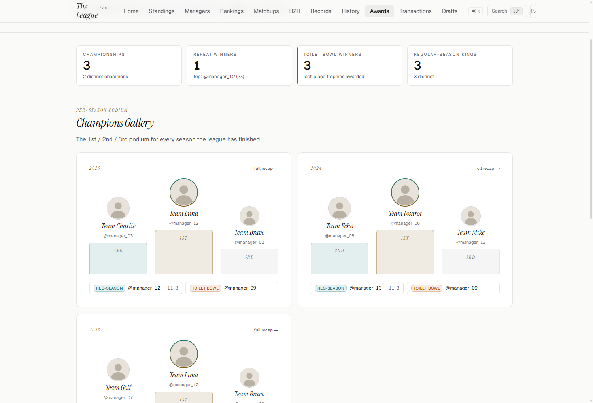<br><sub>Season awards podium</sub></td>
</tr>
<tr>
<td width="50%">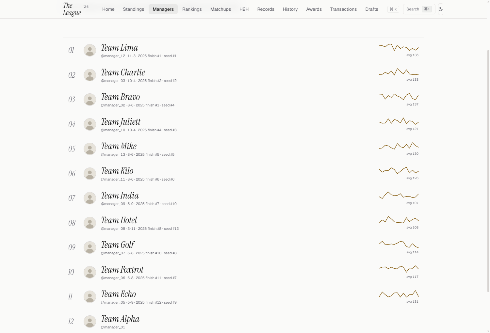<br><sub>Manager directory</sub></td>
<td width="50%" align="center">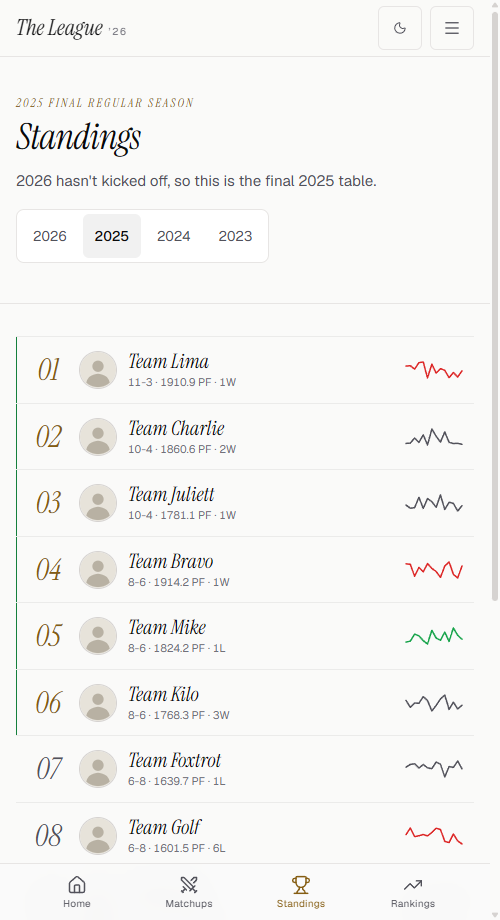<br><sub>Mobile, with a bottom tab bar</sub></td>
</tr>
</table>
</details>

<br>

## Quick start

1. Fork this repository.
2. Find your Sleeper league ID (the long number in your league's URL).
3. Point a host at your fork, set the `SLEEPER_LEAGUE_ID` environment variable, and deploy.

Ingest runs at build time. There is nothing else to configure to get a working site.

> **Never written a line of code?** [TRAINING_WHEELS.md](./TRAINING_WHEELS.md) walks through
> forking, configuring, and deploying step by step, with no terminal and no prior experience assumed.

## Local development

```bash
git clone https://github.com/YOUR_USERNAME/YOUR_FORK.git
cd YOUR_FORK
npm install
echo "SLEEPER_LEAGUE_ID=your_league_id" > .env
npm run ingest   # required on a fresh checkout: pulls Sleeper + FantasyCalc into data/
npm run dev
```

| Command | What it does |
|---|---|
| `npm run dev` | Next.js dev server |
| `npm run ingest` | Pulls Sleeper + FantasyCalc data into `data/`, walking the league's full season history |
| `npm run build` | Production build |
| `npm run start` | Serve a production build |
| `npm run typecheck` | `tsc --noEmit` |
| `npm run lint` / `npm run format` | ESLint / Prettier |
| `npm run test` | Unit test suite (rankings engine, data layer, API clients) via `tsx --test` |

Node 20+ is required.

## Deploying

**Netlify** (default target, free tier). `netlify.toml` is already committed and sets the build command to `npm run ingest && npm run build`, so every deploy pulls fresh data. Import the fork, set `SLEEPER_LEAGUE_ID` in the site's environment variables, deploy.

**Vercel** works too. Override the build command to `npm run ingest && npm run build` in project settings, then set `SLEEPER_LEAGUE_ID`.

Neither host needs a database or any data committed to the repo.

## How the data pipeline works

`npm run ingest` calls the public Sleeper API at build time: it walks the league's `previous_league_id` chain to pull every season the league has played, snapshots users, rosters, drafts, matchups, transactions, and brackets into `data/`, and pulls dynasty and redraft values from FantasyCalc. Nothing is committed to git, every build regenerates it fresh. `.github/workflows/refresh-data.yml` is an optional cron that pings a build hook on a schedule so the live site stays current between deploys, without anyone triggering a manual rebuild.

## Configuration

One required environment variable:

```bash
SLEEPER_LEAGUE_ID=1234567890123456789
```

Find it in your league's URL on sleeper.com: `https://sleeper.com/leagues/<league_id>/league`.

Everything else, team count, PPR, dynasty vs. redraft, QB count, is auto-detected from the Sleeper API. Site-specific text lives in `src/config/site.ts`:

```ts
export const LEAGUE_NAME = "Your League";
export const LEAGUE_YEAR = "2026";
export const LEAGUE_TAGLINE = "Your dynasty league's rosters, records, and receipts.";
export const LEAGUE_DESCRIPTION = "Dynasty fantasy football site for your Sleeper league...";
```

Import it as `import { LEAGUE_NAME } from "@/config/site"`. `LEAGUE_YEAR_SHORT` is derived automatically from `LEAGUE_YEAR`.

For manager bios, accent colors, and the league constitution, see [SETUP.md](./SETUP.md).

## Credits

Inspired by [nmelhado/league-page](https://github.com/nmelhado/league-page), the SvelteKit project that proved a self-hosted Sleeper league site was worth building. This is an independent Next.js project, not a fork: different stack, different data pipeline, different design system, built from scratch. If you want a Svelte site instead of a Next.js one, that is the original and it is excellent.

Data from the [Sleeper API](https://docs.sleeper.com) and [FantasyCalc](https://fantasycalc.com).

## License

MIT, see [LICENSE](./LICENSE).
